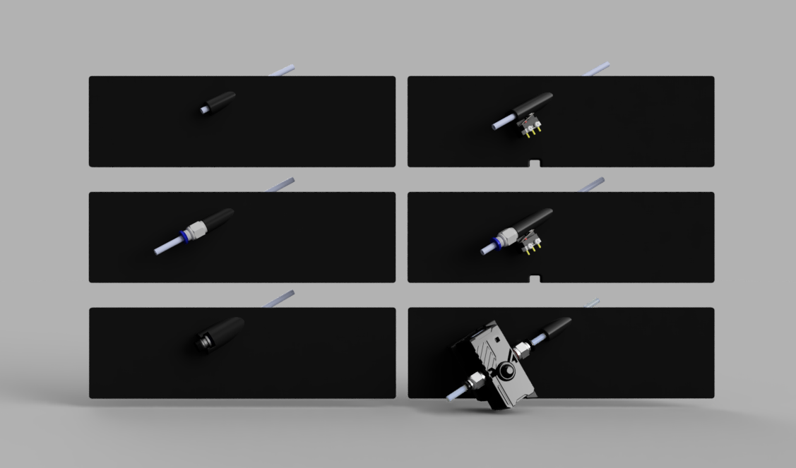

# V0 Upper-Rear Bowden Inlet (URBI)

A Reverse Bowden Inlet for the upper-rear panel of the Voron Zero with an optional filament sensor.

There are 4 Variants:
- URBI - The basic, just a hole to pass the bowden tube through.
- URBI-PC4 - with a thread to install a PC4-M6 fitting
- URBIFS - with a filament sensor
- URBIFS-PC4 - with a filament sensor, and a thread to install a PC4-M6 fitting

Filament sensor variants require a microswitch and 6x3mm magnet.

